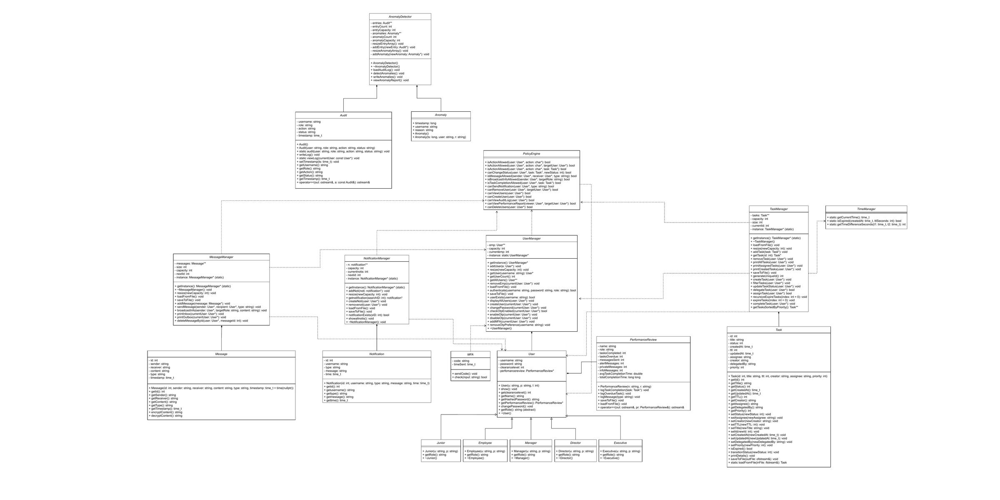

# OSIM Security Simulation

[](https://github.com/Denarzai/Osim-Security-Simulation/actions/workflows/build.yml)

## Project Overview
OSIM Security Simulation is a C++ console application that models an internal organizational environment with role-based access control (RBAC). It was built for an Object-Oriented Programming university course and focuses on secure operational workflows such as authentication, authorization, task handling, communications, audit logging, and anomaly reporting.

The system uses five organizational roles with increasing clearance:
- Junior
- Employee
- Manager
- Director
- Executive

Application state is persisted in text files (for example users, tasks, messages, notifications, audit logs, and performance data), so actions performed in the console menus are retained across runs.

## Class Design
The full UML class diagram is in `docs/finalUML.pdf` (source: `docs/projuml.drawio`).



## Tech Stack
- Language: C++
- Standard libraries: iostream, string, ctime/cstdlib, fstream, iomanip, cstring
- Architecture style: Object-Oriented Programming (classes, inheritance, managers/singletons)
- Data storage: Plain text files (sample data in `data/`)
- Platform target: Console application (cross-platform; developed on Windows)

## Repository Structure

| Path | Contents |
|------|----------|
| `src/` | Implementation files (`.cpp`) |
| `include/` | Headers (`.h`) |
| `data/` | Sample data files the application reads and writes |
| `docs/` | UML class diagram (PDF, draw.io source, PNG export) |

## Features
- Authentication and RBAC
  - Login with role + username + password validation against persisted users.
  - Permission checks centralized in a policy engine using role-to-clearance mapping.

- Optional MFA (OTP)
  - Per-user MFA preference can be enabled/disabled in Account Settings.
  - OTP is generated during login for MFA-enabled users and verified with expiry logic.

- User Account Management
  - View all users (role-restricted).
  - Create new users (Junior/Employee/Manager) with username validation and hashed passwords.
  - Delete users with role-based restrictions.
  - Change password and view account details.

- Task Management
  - Create, assign, delegate, complete, update status, delete, and list tasks.
  - Filter tasks by ID, status, creator, assignee, TTL, and priority.
  - Sort tasks by priority.
  - Automatic task expiry based on TTL.

- Messaging
  - Send messages as PRIVATE, ALERT, or INFO.
  - Broadcast INFO messages to a role or ALL users (subject to policy checks).
  - View inbox/outbox and delete sent messages.
  - PRIVATE message content is stored encrypted in file and decrypted on load.

- Notifications
  - Create INFO/WARNING/EMERGENCY notifications with role-based restrictions.
  - View all notifications and delete with ownership/role checks.

- Performance Review
  - Per-user performance tracking and report generation.
  - Metrics include tasks completed, overdue tasks, message counts by type, average completion time, and a computed score.

- Audit and Anomaly Reporting
  - Security-relevant actions are appended to an audit log.
  - Audit log viewing is role-restricted.
  - Anomaly detector generates a monthly anomaly report from audit data, including:
    - Multiple failed logins in a short time window
    - Logins at unusual hours
    - Failed login after password change
    - Failed password change attempts

## How to Compile and Run
The project does not include a build system file, so compile from source files directly.

### Option 1: g++
From the project root:

```bash
g++ -std=c++11 -O2 -o osim-security-simulation src/*.cpp -Iinclude
./osim-security-simulation
```

On Windows PowerShell, run:

```powershell
.\osim-security-simulation.exe
```

### Option 2: MSVC (Developer Command Prompt)
From the project root:

```bat
cl /EHsc /std:c++14 /Iinclude src\*.cpp /Feosim-security-simulation.exe
osim-security-simulation.exe
```

Note: The application reads and writes its text data files (users.txt, tasks.txt, inbox.txt, notification.txt, audit.txt, performanceLog.txt, preference.txt, anomalyLog.txt) in the current working directory. Sample data lives in `data/` — copy it next to the binary before the first run:

```bash
cp data/*.txt .
```

## Role in Project
Built as a pair project for a university OOP course.

- Sameer Ahmed (Team Lead)
  - GitHub: https://github.com/sameer7075
- Muhammad Subhan
  - GitHub: https://github.com/Denarzai

## Team Responsibilities

This project was developed collaboratively as a 2-person university OOP project.

### Sameer Ahmed (Team Lead)
- Designed overall system architecture and class hierarchy
- Implemented RBAC (Role-Based Access Control) system and policy engine
- Developed authentication system with role-based login validation
- Implemented core task management system (creation, assignment, delegation, priority handling, TTL expiry)
- Designed and implemented messaging system (PRIVATE, ALERT, INFO with encryption for private messages)
- Built audit logging system and anomaly detection module
- Handled file-based persistence and ensured data consistency across modules
- Managed integration of all components and coordinated overall system flow

### Muhammad Subhan
- Implemented the notification system end-to-end: INFO/WARNING/EMERGENCY creation, role-based delivery, file persistence, and ownership-based deletion
- Built task filtering and status update logic in the task management module — filter by ID, status, creator, assignee, TTL, and priority
- Developed inbox and outbox handling in the messaging system, including delivery validation and message management
- Implemented the authentication flow screens and user interaction menus
- Built audit log generation and system monitoring display features
- Led debugging, testing, and stability improvements across the application
